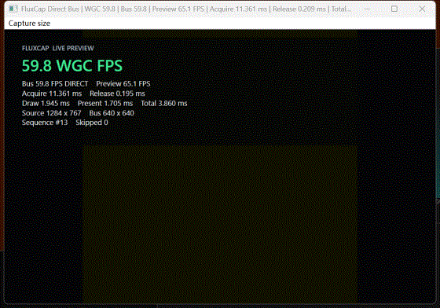

# FluxCap 0.1

[](https://github.com/sxyyds/fluxcap/actions/workflows/ci.yml)

[中文文档](README.md) | **English**



Live preview: `fluxcap_gpu_preview --window HWND` consumes the WGC GPU
texture directly and shows source FPS. The GIF is a downscaled screen
recording, not a quality reference for library output.

Low-latency Windows screen capture as a C++20 library: Windows Graphics
Capture (window/monitor) and DXGI Desktop Duplication (monitor), a
GPU-only processing chain (ROI crop, scale, BGRA8/scRGB -> NV12/P010),
hardware H.264/HEVC/AV1 encoding, and cross-process shared-texture
broadcasting — with an evidence-based "zero redundant copy" discipline
instead of marketing claims.

Licensed under the [MIT License](LICENSE).

## Hello World: one screenshot to PNG

```cpp
#include <fluxcap/gpu.hpp>
#include <winrt/base.h>
#include <windows.h>

namespace gpu = fluxcap::gpu;

int main() {
    winrt::init_apartment(winrt::apartment_type::multi_threaded);

    gpu::WgcCapture capture;
    auto created = gpu::WgcCapture::create_for_monitor(
        MonitorFromPoint({0, 0}, MONITOR_DEFAULTTOPRIMARY),
        nullptr, gpu::WgcCaptureOptions{}, capture);
    if (!created || !(created = capture.start())) return 1;

    gpu::WgcFrameLease frame;
    if (!capture.acquire_latest(1000, frame)) return 1;

    gpu::WicImageEncoder png;
    if (!png.initialize(capture.device())) return 1;
    return png.encode_texture_to_file_sync(frame.texture(), L"screenshot.png")
        ? 0 : 1;
}
```

Link against `fluxcap_gpu` (the CMake target handles its system
dependencies). The CPU-side equivalent is `examples/grab.cpp` plus the
stable C ABI.

## Project status

FluxCap 0.1 was open-sourced as a complete initial drop: the development
history before 0.1 was not backfilled into git and will not be rewritten.
From 0.1 on, the project evolves in small, self-contained commits, with
release scope recorded in [CHANGELOG.md](CHANGELOG.md).

## 30-second summary

Measured on one laptop: RTX 5060 Laptop / Ryzen 9 8945HX / Windows 11
(build 26200) / a single 2560x1600 display. Numbers are valid only for
that tuple; reproduction commands and full distributions are in
[docs/benchmarks-20260909-rx5060.md](docs/benchmarks-20260909-rx5060.md)
(Chinese).

| Path | Result |
|---|---|
| CPU GDI capture of the full 2560x1600 virtual desktop | 46.7 FPS (P50 21.0 ms), 0.41 cores on average |
| WGC window capture -> NV12 -> H.264 (1080p-class surface) | submit-to-encoded-packet P50 **1.6 ms**; zero drops at a 240 fps timeline |
| Same, across H.264/HEVC/AV1 hardware encoders | `encoder copied = 0` everywhere, 600/600 packet coverage |
| 4K (3840x2160) synthetic transform/encode saturation | BGRA->NV12 5,896 ops/s; single-threaded sequential encode 194 packets/s |
| CPU usage | all GPU paths above average 1.1 - 1.5 cores (32-core machine) |

**What "zero-copy to the encoder" means here:** on the measured tuple the
captured texture travels to the hardware encoder with 0 capture-ingress
copies, 0 bus publish copies, 0 encoder-input copies, and 121/121
identity-verified direct submissions. That claim is an evidence ladder,
not a slogan:

| Level | Plain-language meaning |
|---|---|
| L1 | "We handed it over": the texture is submitted as an external resource and no explicit copy call appears in the counters |
| L2 | "Every frame carries ID": texture identity and encoder-bind flags are verified at submission, proving the encoder received the captured texture itself |
| L3 | "Dashcam": a system-wide ETW trace shows no full-frame GPU copy events in the reviewed window, hash-bound offline |
| L4 | "Vendor stamp": extra visibility from vendor tools or qualifications |

Honest boundary: MFT/driver internals are not observable by the runtime
API, and no level proves private firmware work did not happen; evidence
is scoped to the tested adapter/driver/OS/geometry tuple and must be
remeasured elsewhere. Full definitions and tooling:
[docs/copy-evidence-qualification.md](docs/copy-evidence-qualification.md).

## What it is

- **Two CPU-side paths**: a stable C ABI (version 1) around a persistent
  GDI/DIB frame pool that captures the virtual desktop or a desktop ROI
  into CPU-readable BGRX8.
- **One GPU path**: WGC or Desktop Duplication capture straight onto
  `ID3D11Texture2D`, fused ROI mailboxes (crop happens inside the one
  required copy/transform), deterministic or video-processor planar
  conversion, D3D11-aware hardware MFT encoding with raw bitstream
  output, and a multi-slot SharedFrameBus for trusted same-adapter
  consumers across processes.
- **OBS-grade resilience, contract-tested**: worker-side
  `DXGI_ERROR_ACCESS_LOST` rebuild with bounded backoff, idle heartbeat
  republish for static desktops, `IDXGIOutput6` HDR color auto-detection
  with format negotiation, session-limit retry, WTS/power session-event
  awareness, GPU cursor compositing (`include_cursor = true`), a
  multi-monitor virtual-desktop controller, and a CPU GDI fallback
  backend. The ACCESS_LOST rebuild is proven end-to-end by a real
  display-mode-change test (4/4 rebuilds, uninterrupted publishing).

## Capability highlights

| Area | Detail |
|---|---|
| Capture backends | WGC (window + monitor), Desktop Duplication (monitor, native dirty/move rects + independent pointer metadata), Desktop Duplication controller (virtual desktop), GDI fallback |
| Color | BGRA8 sRGB, scRGB FP16, HDR10 (P010 + PQ/BT.2020) with `IDXGIOutput6` auto-detection |
| Rotation | 90/180/270 outputs mapped through one fused VideoProcessor pass (deterministic geometry contracts, compile-time checked) |
| Damage | Native DXGI dirty/move rects with `base_sequence` replay contracts; deterministic planar move mapping; fail-closed fallbacks |
| Encoding | Hardware-only H.264/HEVC/AV1 MFTs, external encoder-input submission with identity verification, bitstream color/HDR10 metadata validation |
| Sharing | v5 SharedFrameBus: 2-8 slots, up to 8 consumers, D3D11 timeline fences, latest-wins, quarantine; single-texture keyed-mutex export |
| Evidence | L1-L4 copy-evidence model with reproducible runtime-L2 qualification tooling and hash-bound artifacts |

## Building

Windows 10/11, CMake >= 3.24, MSVC (C++20), a recent Windows SDK.

```powershell
cmake -S . -B build -DCMAKE_BUILD_TYPE=Release
cmake --build build --config Release
ctest --test-dir build -C Release
```

Options: `BUILD_SHARED_LIBS`, `FLUXCAP_BUILD_EXAMPLES`,
`FLUXCAP_BUILD_BENCHMARKS`, `FLUXCAP_BUILD_TESTS`, `FLUXCAP_BUILD_GPU`.

GPU tests need an interactive desktop with D3D11 video processing and a
hardware H.264 MFT; they skip cleanly otherwise. CI runs the headless
subset.

## Quick start

CPU capture through the stable C ABI:

```c
#include <fluxcap/fluxcap.h>

fluxcap_config config = fluxcap_config_default();
fluxcap_capture capture;
if (fluxcap_create(&config, &capture) == FLUXCAP_OK) {
    fluxcap_frame frame;
    while (fluxcap_acquire_latest(capture, 1000, &frame) == FLUXCAP_OK) {
        /* frame.pixels, frame.width, frame.dirty_regions, ... */
        fluxcap_release_frame(capture, &frame);
    }
    fluxcap_stop(capture);
}
```

Resilient monitor capture into a shared frame bus (see
`examples/resilient_monitor_capture.cpp` for the full DD-with-GDI-fallback
chain):

```cpp
fluxcap::gpu::WgcCaptureOptions options;
options.frame_timeout_ms = 50;
options.access_lost_retry_limit = 0;        // retry forever, bounded backoff
options.idle_republish_interval_ms = 100;   // keep encoders fed on static desktops
options.monitor_session_events = true;      // lock/RDP/power awareness

fluxcap::gpu::DesktopDuplicationCapture capture;
auto created = fluxcap::gpu::DesktopDuplicationCapture::
    create_for_monitor_to_bus(monitor, publisher, options, mailbox, capture);
```

## Honest boundaries

- 240/1000 FPS is not a cross-hardware minimum; the async pipeline trades
  latency for bounded memory (`overwritten_frames`, not backlog).
- No muxer, no audio, no dynamic HDR metadata or automatic tone mapping.
- Secure desktop / UAC / DRM-protected content is not bypassed; such
  frames may be black (`protected_content_frames` counts them).
- Shared textures are same-adapter only (LUID-checked).
- The C++ GPU API is not a stable ABI; use `fluxcap/fluxcap.h` for
  long-term binary compatibility.
- Every capability claim is scoped per adapter/driver/OS/backend/geometry
  tuple; missing qualification-matrix rows mean "not qualified", never an
  implicit pass. See
  [`docs/copy-evidence-qualification.md`](docs/copy-evidence-qualification.md)
  and [`qualification-results/`](qualification-results/).

## Repository layout

- `include/fluxcap/` — public headers (stable C ABI + C++ GPU API)
- `src/`, `src/gpu/` — implementation (WGC, Desktop Duplication,
  controller, GDI fallback, transforms, encoder, bus)
- `examples/` — CPU grab, GPU pipeline/preview, resilient monitor capture
- `tests/` — CPU/GPU/protocol suites and pure policy unit tests
- `benchmarks/` — copy-topology and throughput benchmarks, DD resilience
  qualification workload
- `tools/qualification/` — L2/L3 evidence tooling
- `docs/` — evidence model, bus protocol design documents
  (in Chinese; see the links therein)

The full API reference, color/copy capability matrix, benchmark
methodology, and qualification procedures are documented in the
[Chinese README](README.md).
